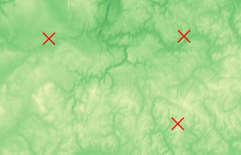
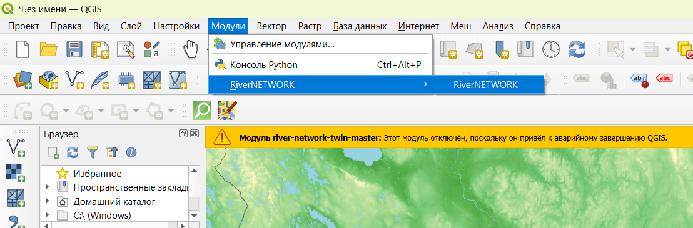
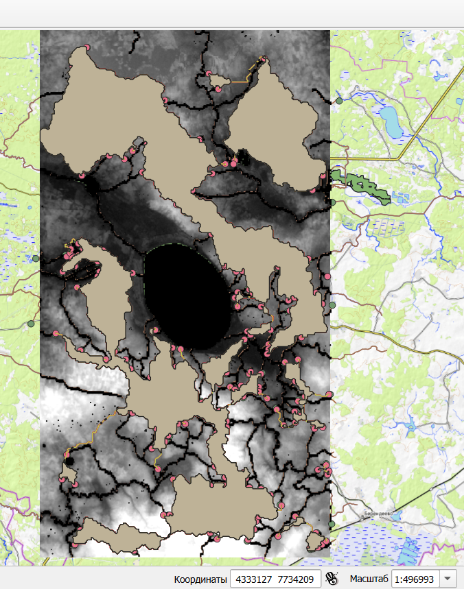

## River Network Twin

Набор инструментов для построения цифрового двойника речной сети в QGIS. Плагин автоматизирует процесс выделения границ водоразделов на основе DEM, сетевых алгоритмов и GIS-алгоритмов.

---

### Содержание

1. [О проекте](#о-проекте)
2. [Структура репозитория](#структура-репозитория)
3. [Подготовка среды](#подготовка-среды)

   * [Требования](#требования)
   * [Рабочая папка](#рабочая-папка)
   * [Установка зависимостей (networkit, networkx)](#установка-зависимостей-networkit-networkx)
   * [Необходимые плагины QGIS](#необходимые-плагины-qgis)
4. [Установка плагина](#установка-плагина)

   * [Установка из ZIP](#установка-из-zip)
   * [Установка из исходников](#установка-из-исходников)
5. [Использование плагина](#использование-плагина)

   * [Задание области анализа](#задание-области-анализа)
   * [Запуск алгоритма](#запуск-алгоритма)
   * [Просмотр результатов](#просмотр-результатов)
6. [Пример использования и видео](#пример-использования-и-видео)

---

## О проекте

Плагин **River Network Twin** (далее – RNT) предназначен для автоматизированного построения полигонов водоразделов на заданной территории в QGIS (версия 3.40.5). Основная идея:

* Построить граф «дорог» минимального перепада высот (Least-Cost-Path, LCP) с использованием библиотеки Networkit.
* Отсечь пути, пересекающие водную сеть.
* Сгруппировать LCP-маршруты по полю `start_id`, чтобы получить предварительные контурные линии.
* Преобразовать линии в замкнутые полигоны (Polygonize) и выполнить финальное слияние (Dissolve).

RNT рассчитан на обработку областей до **1×1°** (примерно 13 млн пикселов DEM) и сотен–тысяч точек-истоков. В результате пользователь получает готовый векторный слой полигонов водоразделов с атрибутами (`id` истока, площадь, средняя высота и т.д.).

---

## Структура репозитория

```text
river-network-twin/
│
├── .github/
│   └── workflows/                # CI/CD: линтинг, автотесты, проверка статики
│
├── docs/                         # Дополнительная документация, схемы, скриншоты
│   ├── screenshots/              # Скриншоты интерфейса и этапов работы плагина
│   └── demo_video.mp4 (опционально) # Демонстрационное видео (если есть)
│
├── src/                          # Исходный код плагина QGIS
│   ├── __init__.py               # Точка входа плагина (либо пустой файл, если используется metadata.txt)
│   ├── main.py                   # Регистрация и запуск плагина в QGIS
│   ├── gui/                      # Файлы интерфейса (Qt Designer .ui + автогенерированные .py)
│   ├── algos/                    # Алгоритмы (LCP, формирование графа, кластеризация)
│   ├── utils/                    # Утилитарные функции (работа с DEM, генерация масок)
│   └── resources/                # Ресурсы: иконки, переводы, константы
│
├── __init__.py                   # Если плагин распознаётся из корня (реже)
├── metadata.txt                  # Обязательный файл метаданных QGIS-плагина:
│                                 # содержит name, description, version, qgisMinimumVersion, author, email и др.
│
├── .gitignore                    # Исключаемые файлы/папки при коммите
└── README.md                     # Этот файл (описание и инструкция)
```

> **Примечание:** Файл `metadata.txt` обязательно должен находиться рядом с `__init__.py` (в корне `src/` или сразу в корне репозитория, в зависимости от настроек). Внутри него указываются свойства плагина, которые QGIS использует для отображения в списке плагинов.

---

## Подготовка среды

### Требования

1. **ОС**: Windows 10/11 или Linux (Ubuntu ≥ 20.04, Debian ≥ 11).
2. **QGIS**: версия **3.40.5** (сборка, совместимая с Python 3.11).
3. **Python**: Python 3.11 (интерпретатор, поставляемый вместе с QGIS).
4. **RAM**: ≥ 8 ГБ ОЗУ для обработки области ≈13 млн пикселов DEM.
5. **Рабочая папка**: путь к папке проекта **не должен содержать кириллических символов** (только латиница, цифры, подчёркивания и т.д.).

### Рабочая папка

* Создайте каталог, где будут лежать демо-данные и проект QGIS.
* Убедитесь, что в пути нет русских букв: например, `C:\Projects\RNT_Work` или `/home/user/RNT_Work`.
* В противном случае QGIS может некорректно обрабатывать UTF-8 пути, и некоторые модули могут не загрузиться.

### Установка зависимостей (networkit, networkx)

Для корректной работы LCP-алгоритма необходимы пакеты **Networkit** и **NetworkX**. Их можно установить следующим способом:

#### Через Python-консоль внутри QGIS

1. Запустите QGIS (версия 3.40.5).

2. Откройте **Python-консоль** (меню «Плагины» → «Python-консоль»).

3. Введите команду:

   ```python
   !pip install networkit networkx
   ```

4. Дождитесь сообщения об успешной установке.

5. Перезапустите QGIS (закройте и откройте заново).

> **Совет:** после установки можно проверить в QGIS-консоли:
>
> ```python
> import networkit
> import networkx
> print(networkit.__version__, networkx.__version__)
> ```
>
> Если ошибок нет и версии отображаются, всё готово.

### Необходимые плагины QGIS

1. **Processing → Providers → SAGA NextGen Provider** (версия ≥ 1.0.0).
2. **Processing → Providers → GRASS** (будет использоваться для некоторых опций).
3. **QuickOSM** (для выгрузки гидрографических данных из OpenStreetMap).

Проверьте, чтобы они были установлены и активированы:

* Меню **«Плагины» → «Управление и установка плагинами…»** → вкладка **Установленные**.
* Найдите **SAGA NextGen Provider**, **GRASS**, **QuickOSM**. Должны быть отмечены галочкой.
* Если нет — переключитесь на вкладку **Все**, найдите и установите.

---

## Установка плагина

### Установка из ZIP

1. Скачайте архив `river-network-twin.zip` из корня репозитория.
2. В QGIS перейдите в меню **«Плагины» → «Управление и установка плагинами…»**.
3. Нажмите кнопку **«Установить из ZIP…»** (обычно справа внизу).
4. Укажите путь к `river-network-twin.zip` и нажмите **«Установить»**.
5. После установки плагин появится в списке **«Установленные»** под именем **River Network Twin**.
6. Активируйте его галочкой. Плагины QGIS автоматически распакуют файлы в папку профиля пользователя (обычно `%APPDATA%/QGIS/QGIS3/profiles/default/python/plugins/river_network_twin`).

### Установка из исходников

1. Клонируйте репозиторий:

   ```bash
   git clone https://github.com/citec-spbu/river-network-twin.git
   ```

2. Скопируйте папку `river-network-twin/river_network_twin/` в директорию плагинов QGIS:

   * **Windows (OSGeo4W)**:

     ```
     %APPDATA%\QGIS\QGIS3\profiles\default\python\plugins\river_network_twin
     ```
   * **Linux**:

     ```
     ~/.local/share/QGIS/QGIS3/profiles/default/python/plugins/river_network_twin
     ```

3. Убедитесь, что структура внутри папки выглядит так:

   ```
   …/python/plugins/river_network_twin/
   ├── __init__.py
   ├── main.py
   ├── gui/
   ├── algos/
   ├── utils/
   └── resources/
   ```

4. Перезапустите QGIS. В меню **«Плагины» → «Управление и установка плагинами…»** появится **River Network Twin**. Активируйте галочкой.

> Если после копирования исходников плагин не появился, проверьте, нет ли лишнего уровня вложенности (папки внутри папки). Структура **должна** начинаться сразу с `__init__.py` внутри папки `river_network_twin`.

---

## Использование плагина

После установки (из ZIP или из исходников) у вас появится новая панель (или пункт в меню) **River Network Twin**. Ниже приведён пример пошагового запуска.

### Задание области анализа

Плагин поддерживает два режима задания территории:

1. **По четырём точкам**

   * Нажмите кнопку **«Область по 4 точкам»**.

   * Укажите последовательно четыре угловые точки на карте (в любом порядке, плагин сам распознает их как углы прямоугольника).

   > 

2. **По центру и радиусу**

   * Нажмите кнопку **«Радиус вокруг точки»**.

   * Выберите **«Выбрать точку на карте»** для указания центра.

   * Кликните по карте, чтобы установить центр области.

   * Введите радиус (в градусах). Например, `0.05` \~ 5 км (при широте около 55°).

   * Нажмите **«Применить»**, и плагин отобразит границу окружности.

   > 

### Запуск алгоритма

1. **Запустите плагин.**

   * В меню **«Плагины»** или на панели инструментов найдите иконку **River Network Twin**.

   > 

2. **Выберите один из режимов расчёта.**

   * **Вычислить путь наименьшей стоимости** — для классического построения LCP.

   * **Вычислить путь наименьшей стоимости с кластеризацией** — если нужно сразу объединить близкие истоки.

   > 

3. **Задайте область анализа** (смотрите раздел выше).

4. **Введите необходимые параметры** (слой DEM, точки-истоки, опции Slope/Variance и так далее).

5. **Запустите расчёт.**

6. **Слияние по признаку (Dissolve).**

   * В QGIS откройте **Инструменты анализа → Слияние по признаку**.

   * В качестве исходного слоя выберите `Output least cost path` (слой с путями).

   * В поле **«Поля классификации»** укажите `start_id`.

   * При необходимости сохраните результат в отдельный файл.

   * Нажмите **«Выполнить»**.

   >   
   > 

7. **Построить полигоны (Polygonize).**

   * К слою, полученному после Dissolve, примените **Vector → Geometry Tools → Построить полигоны**.

   * Не используйте дополнительные параметры, если нет особых требований.

   > 

8. **Повторное слияние по признаку.**

   * К полученному полигональному слою примените снова **Слияние по признаку**, без дополнительных параметров.

9. **Итог: слой водоразделов.**

   * Вы получите готовый слой с полигонами водоразделов.

   > 

### Просмотр результатов

* После успешного завершения процесса появится новый векторный слой в панели **Слои**.
* Откройте таблицу атрибутов, чтобы увидеть поля `start_id`, `area`, `avg_elevation`.
* Рекомендуется сохранить результат в формате **GeoPackage** (`.gpkg`), чтобы внутри хранились атрибуты и метаданные:

  * Правый клик по слою → «Экспорт → Сохранить объекты как…» → выберите GeoPackage.

---

## Пример использования и видео

* **Демо-ролик:**
  Команда подготовила короткое [видео с демонстрацией всех шагов](https://disk.yandex.ru/d/YX9xmytVCefKEA)

  1. Загрузка DEM и точек-истоков.
  2. Выбор области анализа (4 точки или Центр+Радиус).
  3. Запуск расчётов и прогресс-бар.
  4. Получение результирующих полигонов.

---

---

Спасибо за использование **River Network Twin**! Если у вас возникли вопросы или предложения, создайте Issue в репозитории или напишите авторам.


